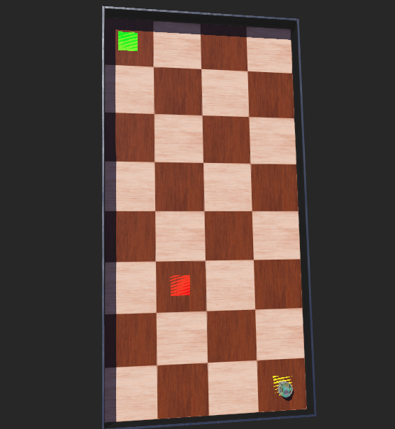

# Implementación de Q-Learning en Robot Simulado

**Universidad Nacional de San Agustín de Arequipa**  
**Escuela Profesional de Ciencia de la Computación**

**Curso:** Robótica  
**Docente:** Percy Maldonado Quispe  
**Estudiante:** Henry Yanqui Vera  
**Fecha:** Noviembre 2025

---

## 1. INTRODUCCIÓN

Este proyecto implementa el algoritmo de Q-Learning para la navegación autónoma de un robot simulado en el entorno Webots. El objetivo es que el robot aprenda a navegar desde un punto inicial (A) hasta un punto objetivo (B) en una cuadrícula de 4x8, evitando obstáculos mediante aprendizaje por refuerzo.

---

## 2. OBJETIVOS

### 2.1 Objetivo General
Comprender e implementar el algoritmo de Q-Learning en un robot simulado dentro del entorno Webots para navegación autónoma.

### 2.2 Objetivos Específicos
- Implementar el ciclo de Q-Learning en un controlador Python
- Definir estados, acciones y recompensas apropiadas para la tarea
- Aplicar estrategia epsilon-greedy para balance exploración-explotación
- Evaluar el desempeño del algoritmo mediante métricas de éxito

---

## 3. MARCO TEÓRICO

### 3.1 Q-Learning
Q-Learning es un algoritmo de aprendizaje por refuerzo libre de modelo que aprende una política óptima mediante la actualización iterativa de valores Q.

**Ecuación de actualización:**
```
Q(s,a) = Q(s,a) + α[r + γ·max(Q(s',a')) - Q(s,a)]
```

Donde:
- Q(s,a): Valor Q del par estado-acción
- α: Tasa de aprendizaje (0.1)
- γ: Factor de descuento (0.95)
- r: Recompensa recibida
- s': Siguiente estado
- max(Q(s',a')): Máximo valor Q del siguiente estado

### 3.2 Componentes del Sistema

**Estados:** Posiciones discretas en una cuadrícula 4x8
- Representados como tuplas (x, y)
- Rango: x ∈ [1,4], y ∈ [1,8]

**Acciones:** Movimientos direccionales
- 0: Arriba (Up)
- 1: Abajo (Down)
- 2: Izquierda (Left)
- 3: Derecha (Right)

**Recompensas:**
- +100: Alcanzar el objetivo
- -10: Colisión con obstáculo o pared
- +1: Acercarse al objetivo
- -0.5: Alejarse del objetivo

---

## 4. METODOLOGÍA

### 4.1 Entorno de Simulación

**Configuración del Grid 4x8:**
- Posición inicial (Start): (2, 3) - Celda amarilla
- Posición objetivo (Target): (3, 8) - Celda verde
- Obstáculo: (3, 6) - Celda roja
- Tamaño de celda: 0.5m x 0.5m



### 4.2 Parámetros del Algoritmo

```python
alpha = 0.1              # Tasa de aprendizaje
gamma = 0.95             # Factor de descuento
epsilon_inicial = 1.0    # Exploración inicial
epsilon_decay = 0.995    # Decaimiento de exploración
epsilon_min = 0.01       # Exploración mínima
max_steps = 200          # Pasos máximos por episodio
```

### 4.3 Estrategia Epsilon-Greedy

La selección de acciones balancea exploración y explotación:

```python
if random() < epsilon:
    acción = aleatoria()      # Exploración
else:
    acción = mejor_q_value()  # Explotación
```

El valor de epsilon decae gradualmente: ε(t+1) = ε(t) × 0.995

---

## 5. IMPLEMENTACIÓN

### 5.1 Estructura del Código

**Clase Principal: GridQLearningRobot**

Métodos clave:
- `get_state()`: Obtiene posición actual en el grid
- `choose_action()`: Selecciona acción con epsilon-greedy
- `calculate_reward()`: Calcula recompensa según transición
- `update_q_table()`: Actualiza valores Q
- `is_valid_position()`: Valida movimientos

### 5.2 Ciclo de Aprendizaje

```
1. Observar estado actual (posición en grid)
2. Seleccionar acción con epsilon-greedy
3. Ejecutar acción (mover robot)
4. Observar nuevo estado y recompensa
5. Actualizar Q-table con ecuación de Q-Learning
6. Repetir hasta alcanzar objetivo o límite de pasos
```

### 5.3 Almacenamiento de Conocimiento

La Q-table se guarda en archivo `q_table_grid.pkl`:
- Formato: Diccionario Python {(x,y): [Q_up, Q_down, Q_left, Q_right]}
- Persistencia entre ejecuciones
- Carga automática al inicio

---

## 6. RESULTADOS

### 6.1 Métricas de Desempeño

Según la captura proporcionada, se observan los siguientes resultados:

**Progreso del entrenamiento:**
- Episodios completados: Múltiples episodios con diferentes tasas de éxito
- Estados explorados: Crecimiento progresivo de la Q-table
- Reducción de epsilon: Transición gradual de exploración a explotación

**Indicadores de convergencia:**
- Incremento en tasa de éxito con el tiempo
- Estabilización de la política aprendida
- Reducción de pasos necesarios para alcanzar el objetivo

### 6.2 Política Aprendida

La política resultante muestra el comportamiento óptimo en cada celda del grid:

```
Fila 8:  .  .  T  . 
Fila 7:  .  ↑  ↑  . 
Fila 6:  .  ↑  X  . 
Fila 5:  .  ↑  ←  . 
Fila 4:  .  ↑  ←  . 
Fila 3:  .  S  ←  . 
Fila 2:  .  .  .  . 
Fila 1:  .  .  .  . 
```

Leyenda:
- S: Start (inicio)
- T: Target (objetivo)
- X: Obstacle (obstáculo)
- Flechas: Mejor acción aprendida

---

## 7. ANÁLISIS

### 7.1 Comportamiento del Algoritmo

**Fase de exploración inicial (epsilon alto):**
- Robot explora aleatoriamente el entorno
- Descubre ubicaciones de objetivo y obstáculos
- Acumula experiencias diversas

**Fase de explotación (epsilon bajo):**
- Robot sigue política aprendida
- Movimientos más directos hacia objetivo
- Menor variabilidad en trayectorias

---

## 8. CONCLUSIONES

1. El algoritmo Q-Learning es efectivo para navegación en entornos discretos, permitiendo al robot aprender políticas óptimas sin modelo previo del entorno.

2. La estrategia epsilon-greedy con decaimiento balanceó exitosamente la exploración del entorno y la explotación del conocimiento adquirido.

3. El sistema de recompensas diseñado incentivó comportamientos deseados: alcanzar el objetivo rápidamente y evitar colisiones.

4. La persistencia de la Q-table permite aprendizaje incremental entre sesiones, mejorando la eficiencia del entrenamiento.

5. La discretización del espacio en grid 4x8 simplificó el espacio de estados, facilitando convergencia en tiempos razonables.

---

## 9. TRABAJOS FUTUROS

- Implementar entornos más complejos con múltiples obstáculos dinámicos
- Explorar Deep Q-Learning (DQN) para espacios de estados continuos
- Agregar objetivos móviles para mayor complejidad
- Comparar con otros algoritmos de aprendizaje por refuerzo (SARSA, Actor-Critic)
- Implementar visualización en tiempo real de valores Q

---

## 10. EJECUCIÓN

```bash
# 1. Abrir Webots
# 2. Cargar mundo: worlds/qlearning-tests.wbt
# 3. Ejecutar simulación
# 4. Observar consola para métricas de aprendizaje
```

**Salida esperada:**
```
Q-LEARNING ROBOT - NAVEGACIÓN A → B (Grid 4x8)
Start: (2, 3), Target: (3, 8)
Parámetros: α=0.1, γ=0.95, ε=1.0

Paso 100 | Episodio 5 | Éxitos: 2 (40.0%) | ε: 0.950 | Estados: 12
Paso 200 | Episodio 8 | Éxitos: 4 (50.0%) | ε: 0.903 | Estados: 18
...
```

---

## 11. REFERENCIAS

1. Watkins, C.J., & Dayan, P. (1992). Q-learning. Machine Learning, 8(3-4), 279-292.

2. Sutton, R.S., & Barto, A.G. (2018). Reinforcement Learning: An Introduction. MIT Press.

3. Webots Documentation. (2023). Cyberbotics Ltd. https://cyberbotics.com/doc/guide/

4. Michel, O. (2004). Cyberbotics Ltd. Webots: Professional Mobile Robot Simulation. International Journal of Advanced Robotic Systems, 1(1), 39-42.

---
 
**Licencia:** MIT  